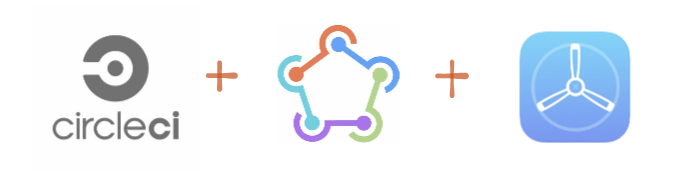

You have a React Native application and you want to automate the process to build the iOS version and make it available to beta testers.

In this post we'll use fastlane to build a sample iOS app written in React Native and a CircleCI pipeline that will build and deploy to Testflight automatically whenever code is merged into a branch.

This is the post I wish was available when I was doing this. Don't worry if you are unfamiliar with some terms. We'll start from scratch without assuming prior knowledge and explain things as we go.

You can check out the final version of the [repo here](https://github.com/CircleCI-Public/circleci-demo-react-native)

- Installing fastlane
- Configuring fastlane
- Code Signing
- Code Signing with Match
- Build the app
- App Store Connect
- Submit to TestFlight
- Using CircleCI

-------
## Installing fastlane

[fastlane](https://fastlane.tools/) is an app automation tool you'll come across when working with iOS. We'll use it to build and deploy to Testflight, although there are a bunch of other things [you can use it for](https://docs.fastlane.tools/). Let's see how to install it.

Install the Xcode command line tools

```shell
xcode-select --install
```

Since fastlane is written in Ruby, ensure Ruby is installed (version 2.5 or newer). These steps can also be found in the [fastlane docs](https://docs.fastlane.tools/getting-started/ios/setup/)

```shell
ruby -v
# ruby 3.0.3p157 (2021-11-24 revision 3fb7d2cadc) [x86_64-darwin20]
```

If Ruby is not installed, follow the [instructions here](https://www.ruby-lang.org/en/documentation/installation/) to install it.

Install *Bundler*, the Ruby gems manager, to track the dependency on fastlane. Bundler will also be used to run fastlane from the terminal to speed up execution. 

```shell
gem install bundler
```

Inside your `ios` folder, create a `Gemfile` file with this content:

```
source "https://rubygems.org"

gem "fastlane"
```

Install fastlane and its dependencies with:

```shell
bundle update
```

`bundle update` will create a `Gemfile.lock` file. Make sure it is added to source control.

If you run into an issue with `bundle update`, most likely it is because of the ruby version installed in your machine. In my case, I had the default 2.6.3 version that comes with macOS Big Sur, known as "system ruby", and had to update to the latest 3.0.3. Follow the instructions from [this StackOverflow answer](https://stackoverflow.com/a/68118750/129103) to upgrade your ruby version. After that, you should be able to `bundle update`.

Confirm the installation is complete by running: 

```shell
fastlane -v

fastlane installation at path:
/Library/Ruby/Gems/2.6.0/gems/fastlane-2.198.1/bin/fastlane
-----------------------------
[✔] 🚀 
fastlane 2.198.1
```

Nice! You have fastlane installed and are now ready to set up your project to use it.

-------
## Configuring fastlane

If you don't have a React Native project and want to follow along, create a new project with:

```
npx react-native init
```

Go inside the `ios` folder to initialize `fastlane`

```shell
cd ios
fastlane init
```

fastlane will ask if you want to include a pre-built task in your automation. We'll manually do all this so enter **4**.

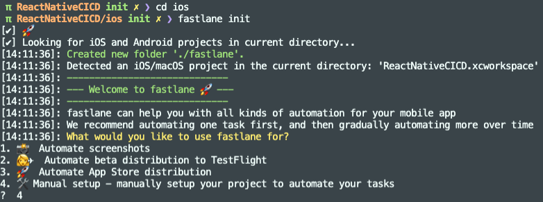
A new `fastlane` folder was created with 2 files:

- **Appfile** - contains the app identifier (or bundle id) and the apple id.
- **Fastfile** - stores the definition of what you want to automate (build, test, deploy to TestFlight, deploy to the AppStore...)

In the Appfile, feel free to remove `apple_id`. We'll use an App Store Connect API Key instead to authenticate, so we won't need it.

Uncomment the `app_identifier` line and set your bundle identifier. The Appfile should look similar to this:

```
# Appfile
app_identifier("com.awesomecompany.reactnativecicd")
```

Note: when *fastlane* asks for the *app_identifier* it means the *bundle ID* (not to be confused by the *App ID* from the Developer Portal)

#### What's a Bundle ID?

The bundle identifier uniquely identifies an application within the Apple ecosystem. This means no two applications can have the same bundle ID across the entire App Store. 

This is defined in Xcode and Apple encourages to use [reverse domain name notation](https://en.wikipedia.org/wiki/Reverse_domain_name_notation) (eg. *com.my-company.myapp*), but it can really be anything you want, as long as it's unique and it's not already taken.

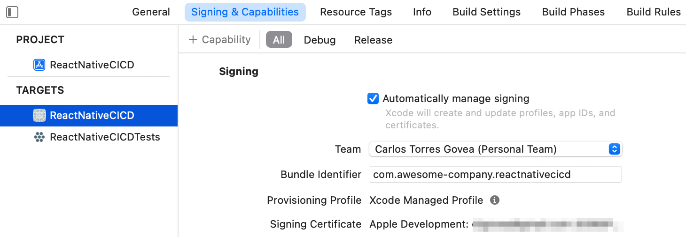

Once you publish an app to the App Store, the bundle ID cannot be modified. Well, it could, but you would lose your app history, reviews.. in the App Store.

#### Wait, so what's an App ID then?

The App ID combines both the Team ID and the Bundle ID.

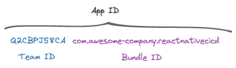

This is what you see when you register a new *App ID* in the Developer Portal

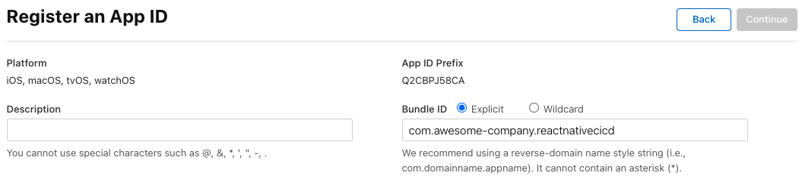

-------
## Code signing

> 📚 Code signing happens during the build, to ensure nobody has tampered with your app. It assures your app's code can be trusted and hasn't been modified.

*Code signing* is a scary term and it is common to bump into errors with it.

You see, in order to build an iOS you need a couple of secret files (certificates, private keys and provisioning profiles) to ensure it is *you* building the app and that it can be trusted. These files are meant to remain secret.

Problem is, these things expire, you have to keep track of them, and every developer in your team can end up having their own. *New dev in the team? Uhm, what was the process to onboard her, again?* 

More so, when you go on to automate the build process using a CI/CD tool, like CircleCI, a remote machine is going to do the build (no longer a developer's macbook from your team) so where do you store these code signing secrets?

-------
## Code Signing with Match

fastlane [match](https://docs.fastlane.tools/actions/match/) simplifies sharing certificates and provisioning profiles across your team. Even "sharing" them with your CircleCI build pipeline.

You create a separate private Git repo to store a single encrypted version of your code signing identity and you specify a passphrase to decrypt the files. In addition to git, S3 and Google Cloud can also be used.

So, instead of giving your developers access to the Apple Developer Portal, you give them access to a git repo and give them a passphrase.

Create a private git repository for match (eg. in Github or BitBucket) and copy the url. This repo should be different from your project source code repository.

In your terminal run:

```shell
fastlane match init
```

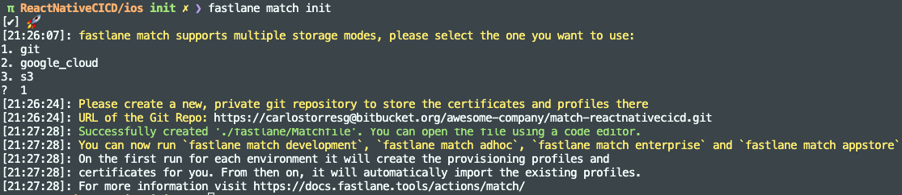

A `Matchfile` file has been created pointing to the private git repo specified. 

```shell
git_url("https://carlostorresg@bitbucket.org/awesome-company/match-reactnativecicd.git")

storage_mode("git")

type("development") # The default type, can be: appstore, adhoc, enterprise or development
```

To do the following, make sure you already have an App ID with your bundle identifier in the [Developer Portal](https://developer.apple.com/).

Create a development certificate with:

```shell
fastlane match development
```

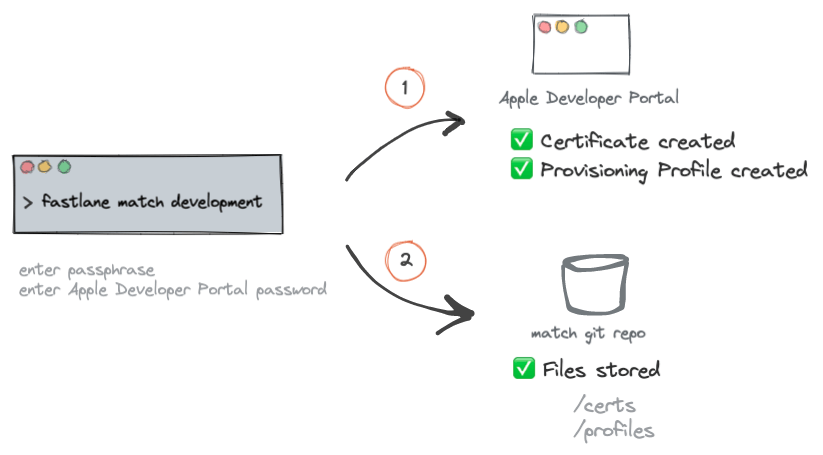

When running *match* for the first time on a new machine, you will be asked for a passphrase. This is an additional layer of security as each of the files are encrypted using `openssl`. As we want CircleCI to do the build for us, we'll set the passphrase in an environment variable in CircleCI later on.

Secondly, you will be asked for a username and password to the Apple Developer Portal so *fastlane* can create files for you. The username is the email you use to sign in to the Apple Developer Portal.

In the Apple Developer portal, in the [certificates list](https://developer.apple.com/account/resources/certificates/list), you should see a new "development" certificate was created along with a new [provisioning profile](https://developer.apple.com/account/resources/profiles/list)

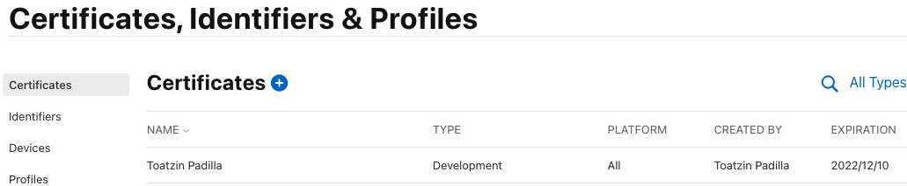

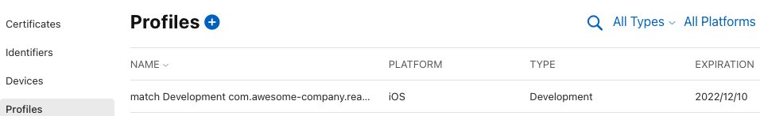

Similarly, you should see the files now show up in your git match repository.

Under the hood, *fastlane* uses 2 actions: [cert](http://docs.fastlane.tools/actions/cert/#cert) and [sigh](http://docs.fastlane.tools/actions/sigh/#sigh), to create/get certificates and provisioning profiles respectively.

### Sharing signing secrets with your team

Once files are created in the repo, your team can get them by using the `read-only` option. This command doesn't ask you for a password to the Apple Developer portal. Just provide them with the passphrase so fastlane can decrypt the files (they should have access to the private match repo too).
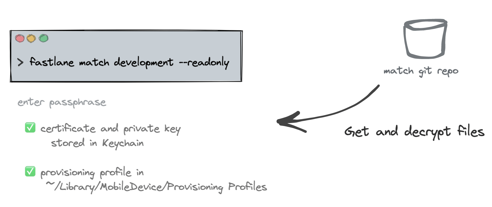
The *"development"* certificate is used to deploy to internal devices in your team.

Similarly, you can create a *"distribution"* certificate to deploy your app to TestFlight and the AppStore.

```shell
# create a distribution certificate
fastlane match appstore 
```

### Update your Fastfile

Now that our match repo has the code signing secrets, let's update the *Fastfile* to grab them. Fastlane has the concepts of *lanes* to group instructions. You can think of them as functions. We'll create a new `certificates` lane (but can be named anything really).

```ruby
default_platform(:ios)

platform :ios do

	desc 'Fetch certificates and provisioning profiles'
	lane :certificates do
	  match(
		app_identifier: "com.awesomecompany.reactnativecicd",
		username: "myusername@domain.com",
		type: "development",
		storage_mode: "git",
		git_url: "https://myusername@bitbucket.org/awesome-company/match-reactnativecicd.git",
		readonly: true
	  )
	end
end
```

We can simplify our *Fastfile* further since we have `app_identifier` already defined in the `Appfile` and some other properties in the `Matchfile`. 

```ruby
default_platform(:ios)

platform :ios do

	desc 'Fetch certificates and provisioning profiles'
	lane :certificates do
	  match(
		readonly: true
	  )
	end
end
```

You could run the lane with

```shell
faslane ios certificates
```

to get an output like this. 

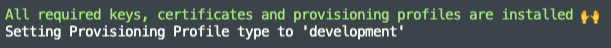

But, we actually won't use the `certificates` lane directly. We'll create another lane to build the app and we'll call certificates from there.

### Manual signing in Xcode

Note that when you're code signing with fastlane match, you need to disable *automatic code signing* in your Xcode project.

Select the correct *Provisioning Profile*.

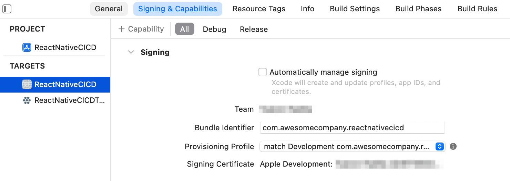

The provisioning profile set in your Xcode needs to be of the same type (appstore, development) as the one you are pulling from your match repo, otherwise you can get the `Xcode couldn't find any provisioning profiles matching...` or `No signing certificate "iOS Development" found` error.

### What's a Provisioning Profile anyway?

There is no way to install an iOS application on a real device without a provisioning profile.

> 📚 A Provisioning Profile is stored on your phone and contains a set of certificates, device identifiers, the entitlements and the App Id

A provisioning profile is required for installing an app in your phone and contains 4 important things:

1. **App Id** - App Unique identifier
2. **List of certificates** - who can run the app
3. **List of device identifiers** - which devices can run the app
4. **Entitlements** - capabilities enabled in the app (eg. In-App Purchase, Push Notifications, Sign in with Apple...)

These 4 items can be seen when you open a [Provisioning Profile](https://developer.apple.com/account/resources/profiles) in the Apple Developer portal.

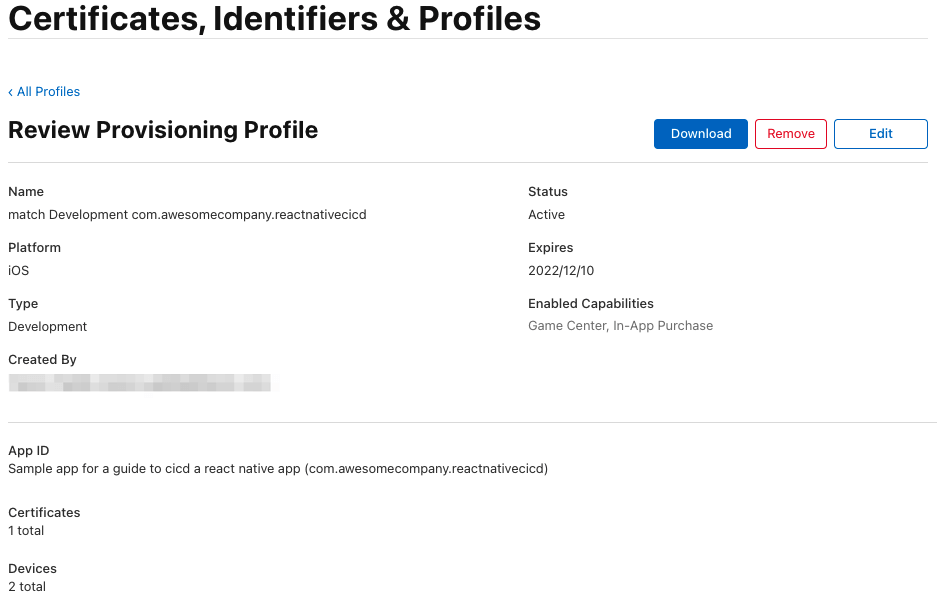

> A provisioning profile is a collection of digital entities that uniquely ties developers and devices to an authorized iPhone Development Team and enables a device to be used for testing. [iPhone Developer Program](https://developer.apple.com/programs/information/Apple_Developer_Program_Information_8_12_15.pdf)

-------
## Building the app

Add a build lane to your Fastfile

```ruby
desc 'Fetch code signing secrets. Build the iOS application.'
lane :build do
	certificates
	# Creates a signed file
	gym(
		export_method: 'development'
	)
end
```

Build the application by running on your terminal:

```shell
fastlane ios build
```

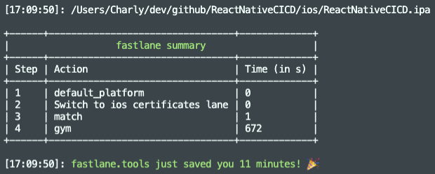
Congratulations, you have a signed .ipa file! 

Let's now turn our attention to deploying to TestFlight.

-------
## App Store Connect

To deploy to TestFlight, fastlane needs to be able to connect to your Apple Store Connect account. Let's see how we can generate a token we can use in fastlane.

The recommended and official way to authenticate is via an API key. Not all fastlane features are supported by the App Store Connect API but [most of them are](https://docs.fastlane.tools/app-store-connect-api/), including what concerns us here: deploying to Testflight.

>Note: [2FA is also supported](https://docs.fastlane.tools/getting-started/ios/authentication/) by fastlane. This means, when you run a certain fastlane action requiring authentication, you are prompted for a username, password and the 2-factor-authentication code. But, as it turns out, you wouldn't want your CircleCI pipeline step to suddenly stop prompting you to enter a 2FA code (actually [happened to me](https://twitter.com/ctgovea/status/1483615498185150466)). This is where the API key comes handy.

### Generating an API Key in AppStore Connect

You will need an App Store Connect admin account for this. 

Navigate to the [Users and Access > Keys](https://appstoreconnect.apple.com/access/api) page and click "Generate API Key" or the Add (+) button.

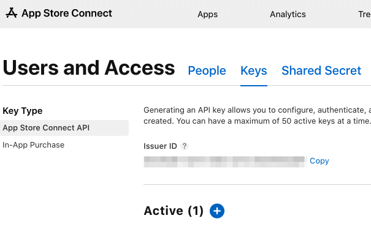

Give it a name and select the role with the [minimum access you need](https://help.apple.com/app-store-connect/#/deve5f9a89d7). Unfortunately, an API Key cannot be restricted to specific apps. 

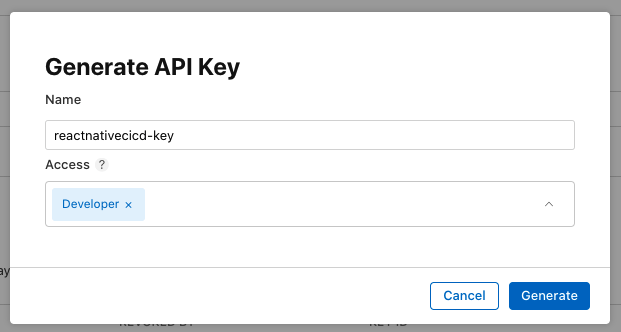

Refresh the page to see the newly created key (it can take up to a few seconds for the *Download API Key* button to appear)

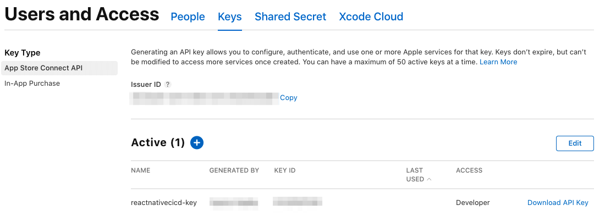

Copy the *issuer_id*, *Key ID* and download the key (can only be done once).

The API key is in the `.p8` format and some CI/CD tools [don't like the line breaks](https://github.com/fastlane/fastlane/issues/17340) in it. You might want to consider using a base64 encoded version instead. 

```bash
cat AuthKey_ABCDEFGH.p8 | base64
```

### Authenticating fastlane to App Store Connect

fastlane uses the [`app_store_connect_api_key`](http://docs.fastlane.tools/actions/app_store_connect_api_key/#app_store_connect_api_key) action to authenticate to App Store Connect.

```shell
app_store_connect_api_key( 
  key_id: "D83848D23", 
  issuer_id: "227b0bbf-ada8-458c-9d62-3d8022b7d07f",
  key_content: "result of cat AuthKey_ABCDEFGH.p8 | base64",
  is_key_content_base64: true,  
  in_house: false  
)
```

Better yet, you can use environment variables and if you name them as specified below they will be automatically loaded.

In your `/ios/fastlane/` folder, create an `.env` file that will be used when running *fastlane* locally. We'll set these in CircleCI as well when we get to set up the pipeline. Don't check-in the `.env` file to source control.

```env
APP_STORE_CONNECT_API_KEY_KEY_ID=D83848D23
APP_STORE_CONNECT_API_KEY_ISSUER_ID=227b0bbf-ada8-458c-9d62-3d8022b7d07f
APP_STORE_CONNECT_API_KEY_KEY=YourBase64Key
APP_STORE_CONNECT_API_KEY_IN_HOUSE=false
```

Now you can authenticate with App Store Connect in your *Fastfile* just by calling the action directly. The environment variables will be picked up automatically as long as you named them as specified above.

```
app_store_connect_api_key()
```

------
## Submit to Testflight

TestfFlight is Apple's beta distribution service. Beta users install Apple's TestFlight app on their phone, you as admin invite them to your app and whenever there is a new version available they get nice push notifications prompting to install it.

### Setting up fastlane pilot

Add a new lane to use the [pilot](https://docs.fastlane.tools/actions/pilot/) action (aka *upload_to_testflight*)

```ruby
desc "Upload to TestFlight"
lane :beta do
	# Using default env variable names for fastlane to pick them up. 
	app_store_connect_api_key(
		is_key_content_base64: true,
	)
	pilot 
end
```

Make sure your app exists in [App Store Connect](appstoreconnect.apple.com), otherwise create it (make sure to use the same bundle ID).

Use the *beta* lane to submit to TestFlight:

```shell
fastlane ios beta
```

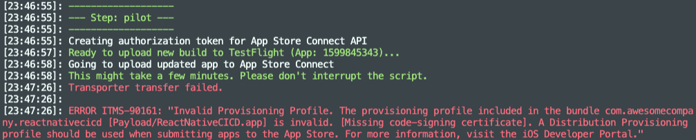
Error: *"A Distribution Provisioning profile should be used when submitting apps to the App Store"*

Ah, that's right, we're using a `development` provisioning profile but we need an `distribution` profile in order to submit to TestFlight.

If you haven't already, create a distribution certificate and profile with:

```bash
fastlane match appstore
```

We require to build the application again, this time using a distribution profile. Before rebuilding, apply these 3 changes:

1. Change the type in `Matchfile` from `development` to `appstore`
 
2. In `Fastfile` change the `export_method` to `app-store` (note the hyphen) 

3. In Xcode, update the provisioning profile under *Signing & Capabilities* to use "match AppStore [your.bundle.id]".
	
	Note: if you see an error *"Provisioning profile (...) doesn't include signing certificate"* try restarting Xcode 🤷‍♂️.

Rebuild the app and submit to TestFlight.

```shell
fastlane ios build
fastlane ios beta
```

-----
## Using CircleCI

So far everything we've done has been locally. We get signing secrets, build and submit to TestFlight from our computer.

Finally, let's create a pipeline in CircleCI to do this for us. It will bring us a few advantages:

💻 Build in the cloud, not from your developer's mac
🚫 No need to grant your team access to the Developer Portal
🔑 Keep your signing secrets... secret! :) 
💥 Start building as soon as there is new code in your repo
🚀 Submit the new build to Testflight automatically
👩‍🔬 Testers in Testflight will get a notification when a new version becomes available

### Connecting Bitbucket and CircleCI

CircleCI needs to have access to our match repository to read the signing secrets. In our case, we are using BitBucket for the match repo.

In CircleCI, create a Bitbucket user key by following [these steps from the documentation](https://circleci.com/docs/2.0/gh-bb-integration/#creating-a-bitbucket-user-key).

Then, [set up the SSH key in Bitbucket](https://support.atlassian.com/bitbucket-cloud/docs/set-up-an-ssh-key/)


### Ensure you have an SSH match repo address

There are 2 types of addresses in git repositories: HTTP and SSH. 

You might have noticed we had been using http to read signing secrets from our match repo that looks like this:

```bash
# HTTP repo address
https://carlostorresg@bitbucket.org/awesome-company/match-reactnativecicd.git
```

This is fine when running fastlane locally your using your specific username, but for CircleCI we need an SSH address:

```bash
# SSH repo address
git@bitbucket.org:awesome-company/match-reactnativecicd.git
```

You can get the SSH address in Bitbucket by clicking Clone in the top-right, and then selecting SSH from the dropdown

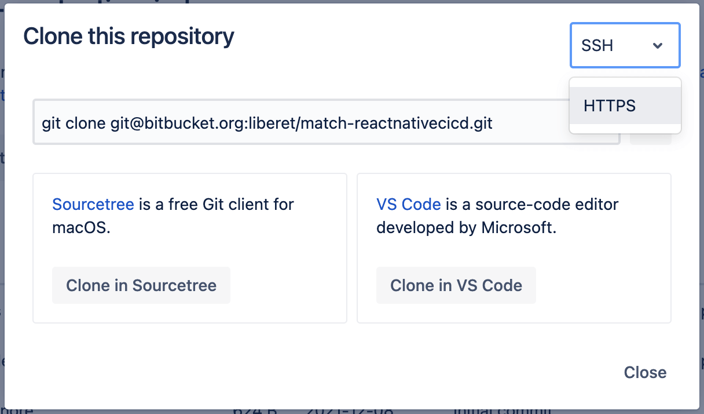

### Add environment variables to CircleCI

Since we are not commiting the `env` file to the repo, we'll add the variables to CircleCI so they can be accessible to `fastlane`. 

Go to your **Project Settings** in CircleCI.

In **Environment Variables**, add the following variables, replacing the values with your own.

```
APP_STORE_CONNECT_API_KEY_KEY_ID=D83848D23
APP_STORE_CONNECT_API_KEY_ISSUER_ID=227b0bbf-ada8-458c...
APP_STORE_CONNECT_API_KEY_KEY=YourBase64Key
APP_STORE_CONNECT_API_KEY_IN_HOUSE=false
FASTFILE_APP_IDENTIFIER=com.awesomecompany.reactnativecicd
FASTFILE_GIT_URL=git@bitbucket.org:awesome-company/match-reactnativecicd.git
FASTFILE_GYM_EXPORT_METHOD=app-store
FASTFILE_ITC_TEAM_ID=123456789
FASTFILE_MATCH_TYPE=appstore
FASTFILE_TEAM_ID=Q2CBPK58CA
FASTFILE_USERNAME=admin_email@in-apple-developer-portal #
```

### Use environment variables
The environment variables defined in CircleCI can be accessed in your fastlane files via `ENV["VARIABLE_NAME"]`. 

Let's update the `Matchfile`, `Appfile` and `Fastfile` to use them.

Matchfile
```ruby
app_identifier(ENV["FASTFILE_APP_IDENTIFIER"])
git_url(ENV["FASTFILE_GIT_URL"])
storage_mode("git")
type(ENV["FASTFILE_MATCH_TYPE"])
username(ENV["FASTFILE_USERNAME"])
```

Appfile
```ruby
app_identifier(ENV["FASTFILE_APP_IDENTIFIER"]) # The bundle identifier of your app

apple_id(ENV["FASTFILE_USERNAME"]) # Your Apple email address

itc_team_id(ENV["FASTFILE_ITC_TEAM_ID"]) # App Store Connect Team ID

team_id(ENV["FASTFILE_TEAM_ID"]) # Developer Portal Team ID
```

Fastfile
```ruby
desc 'Fetch code signing secrets. Build the iOS application.'
lane :build do
	certificates
	gym(
		export_method: ENV["FASTFILE_GYM_EXPORT_METHOD"]
	)
end
```

There's no need to specify the `APP_STORE_CONNECT_API_KEY_*` variables anywhere. Since we explicitly named them that way, `fastlane` will automatically load them up. So, our beta lane can still remain like this.

```ruby
desc "Upload to TestFlight"
lane :beta do
	# Using default env variable names for fastlane to pick them up.
	app_store_connect_api_key(
		is_key_content_base64: true,
	)
	pilot
end
```

### Add setup_circle_ci action

There's one more thing we need to do in `Fastfile`. We need to add the `setup_circle_ci` Fastlane action:

```ruby
# fastlane/Fastfile

platform :ios do
	before_all do
		setup_circle_ci
	end
```

From the [CircleCI docs](https://circleci.com/docs/2.0/testing-ios/#setting-up-fastlane-for-use-on-circleci), this will do 3 things: 

-   Create a new temporary keychain for use with Fastlane Match (see the code signing section for more details).
-   Switch Fastlane Match to `readonly` mode to make sure CI does not create new code signing certificates or provisioning profiles.
-   Set up log and test result paths to be easily collectible.


### One last thing...

⚠️ Make sure you are using an *appstore* provisioning profile in Xcode since we want to deploy to Testflight.

### CircleCI pipeline

CircleCI has a [circleci-demo-react-native](https://github.com/CircleCI-Public/circleci-demo-react-native) repo. We will use their sample `config.yml` to build our own. You can see our final [config.yml here](https://github.com/govea/ReactNativeCICD/blob/main/.circleci/config.yml)

We'll have a single workflow `build-deploy-testflight` containing 3 jobs (linter, approval, ios-build) that will trigger whenever there is a merge in a `development` branch. 

The `linter` job will execute by default and, if there is approval from an admin in CircleCI (and the linter was successful), the iOS build and deployment to Testflight will kick in

```yml
workflows:
  version: 2
  build-deploy-testflight:
    jobs:
	  - linter:
          filters:
			branches:
			  only: development
	  - approve-build-send-testflight:
	      type: approval
	  - ios-build:
		  requires:
		    - linter
		    - approve-build-send-testflight
```

The process looks like this in CircleCI
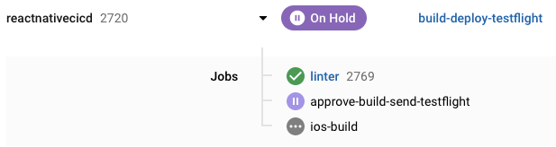

And once the approval is given it continues to build and deploy to TestFlight.

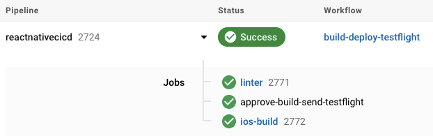


## Conclusion

Automating the building and delivery of an iOS application can be a daunting task. fastlane helps us abstract a lot but it is easy to have things fall through the cracks with all the different tools involved. Hope this guide was helpful to distill the steps that are required and to see how they all fit together..