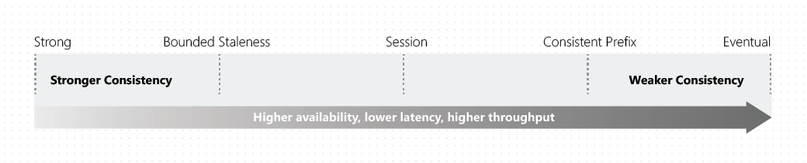

## *Develop Azure Infrastructure as a Service Solutions*
---

 Welcome to Part 1 of the [AZ-203 study guide]((../passing-az-203-exam/)). In this post we'll cover:

- [Azure Batch](#azure-batch)
- [Containerized Solutions](#containerized-solutions)
---

## Azure Batch

Azure Batch lets you run large scale parallel and high-performant computing (HPC) jobs. Okay, that was a mouthful. All you need to know are the CLI commands to create jobs, their tasks and a pool.

``` bash
az batch pool create 
    --id "my-pool-name" 
    --vm-size Standard_A1_v2 
    --target-dedicated-nodes 2
    --image canonical: ubuntuserver:16.04 LTS
    --node-agent-sku-id "batch.node.ubuntu.16.04"
```

``` bash
az batch job create 
    --id "my-job"                          
    --pool-id "my-pool-name"
```

``` bash
az batch task create 
    --task-id "my-task"
    --job-id "my-job"
    --command-line "echo 'I am the task running...'"
```

## Containerized Solutions

You might be asked the structure of a Dockerfile, so remember this flow: 

` FROM ➡️ WORKDIR ➡️ COPY ➡️ ENDPOINT `

### Azure Kubernetes Service (AKS)

```bash
az aks create 
    -g "my-resource-group-name"
    - n "my-cluster"
    --node-count 1
    --generate-ssh-keys
```

## Azure Storage

Familiarize yourself on how to query data and apply filters from C# with `TableQuery.GenerateFilterCondition` and `TableQuery.Where`

``` c#
public static async Task<List<User>> FindUsersAsync(CloudTable table, string name)
{
    // ⚠️ Remember how to create filters!
    var filterCondition = TableQuery.GenerateFilterCondition(
                                        "Name", 
                                        QueryComparison.Equal, 
                                        name);
    var query = new TableQuery<User>.Where(filterCondition);
    var results = await table.ExecuteQuerySegmentedAsync(query, null);    
    
    return results.ToList();
}
```
Do checkout the other methods such as `TableOperation.Retrieve, TableOperation.Delete`

## Cosmos DB

*Create a Cosmos DB account*
```bash
az cosmosdb create
    -g "my-resource-group-name"
    --name "cosmosDBaccountname"
    --kind GlobalDocumentDB  # MongoDB | Cassandra | Gremlin

```
*Create a database*
```bash
az cosmosdb database create
    - g "my-resource-group-name"
    --name "cosmosDBaccountname"
    --db-name "my-database"
```

### Consistency Models

Read up on the different
[Azure Cosmos DB Consistency Levels](https://docs.microsoft.com/en-us/azure/cosmos-db/consistency-levels) and know when to use them, specially the `Strong` and `Bounded Staleness` (the most expensive ones, by the way). 



You might be asked "you need to ensure reads reflect the most recent write". To which the answer would be a `strong` consistency level.

## Blob Storage

The exam tends to ask questions about concurrency control in blobs. This involves using leases to checkout and block files so only you can update.

```c#
var leaseId = Guid.NewGuid().ToString();

cloudBlockBlob.AcquireLease(TimeSpan.FromSeconds(30), leaseId);

await cloudBlockBlob.ReleaseLeaseAsync(new AccessCondition()
{
    LeaseId = leaseId
})
```