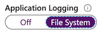

## *Monitor Azure Solutions*
---

 This is Part 5 of the [AZ-203 study guide](../passing-az-203-exam/). In this post we'll cover:

- [Web App Logging](#web-app-logging)
- [App Insights](#app-insights)
- [Usage Analytics](#usage-analytics)
- [Optimize Azure Solutions](#optimize-azure-solutions)
- [Redis Caching for ASP.NET](#redis-caching-for-aspnet)
---

### Web App Logging

### Filestream logging

#### 1. Enable Application Logging with the CLI
By default, application logging (both on filestream and blob) is disabled when you create a new application in Azure.

```bash
az webapp log config
  -n $appName
  -g $resourceGroup
  --level information   # error | warning | information | verbose
  --application-logging true
```

After running this CLI command, you'll see application logging is turned on for your app.



#### 2. Enable logging in your app

```c#
// Program.cs

public static IWebHostBuilder CreateWebHostBuilder(string[] args
  WebHost.CreateDefaultBuilder(args))
  .ConfigureLogging(logging =>
  {
    logging.AddAzureWebAppDiagnostics();  // ⚠️
  })
  .UseStartup<Startup>();
```

#### 3. Inject Logger in Controller
```c#
private ILogger _logger = null;

public HomeController(ILogger<HomeController> logger)
{
  _logger = logger;
  _logger.LogInformation("Hello from HomeController");
}
```

#### 4. Tail the logs

```bash
az webapp log tail
  --n $appName
  -g $resourceGroup
```

With this command, you can connect a terminal to log streaming service of an application. You should then see the log messages you output in your app as you click around.


### Blob logging

```c#
private static async Task runAsync() 
{
  //...

  var serviceCredentials = await ApplicatinoTokenProvider.LoginSilentAsync(
    tentantId, clientId, clientSecret);

  // ⚠️ We configure the app through the WebSiteManagementClient class
  var client = new WebSiteManagementClient(serviceCredentials);

  var appSettings = new StringDictionary(
    name: "properties",
    // ⚠️ Changing the configuration of the logging using blobs
    properties: new Dictionary<string, string> {
      { "DIAGNOSTICS_AZUREBLOBCONTAINERSASURL", sasUrl },
      { "DIAGNOSTICS_AZUREBLOBRETENTIONDAYS", "30" },
    }
  );

  // ⚠️ 
  client.WebApps.UpdateApplicationSettings(
    resourceGroupName: resourceGroupName,
    name: webSiteName,
    appSettings: appSettings
  );
}
```

### App Insights

These are the types of samplings you can have:

**Adaptive sampling** <br>
Adjusts data sent from the SDK and your app (default)

**Fixed-rate sampling** <br>
You set the rate, and the client and server synchronize sampling rate

**Ingestion sampling** <br>
<span style="text-decoration: underline">It is configured in the portal</span> and discards some data as it arrives from your app. But, does not reduce traffic (only storage requirements and cost).

```bash
# ⚠️ How to reduce cost of storing data in Application Insights?

Implementing Ingestion Sampling by configuring it in the portal.
```

### Usage Analytics

This is not a big part of the exam, maybe one question.

| Feature      |   Need     | More info |
| :------------- | :----------: | -----------: |
| Funnel |  Which pages relate to create a customer ticket? | Track progression of a user through a series of steps in your app |
| Impact   | How do page load times influence conversion rates? | Page load times vs conversion |
| Retention   | How many users return? | People returning |
| User Flows   | Are there places where users repeat the same action over and over? | Repeat Actions |

### Optimize Azure Solutions

Azure has a service called Azure Monitor to autoscale.

**Autoscaling** is a feature of Azure to dynamically allocate (and remove) resources to match the demands of the application.

**Vertical scaling** <br>
Changing the capacity of a resource (CPU, VM size). 

NOTE: This has downtime.

**Horizontal scaling** <br>
Scaling out and in, meaning we add or remove instances of a resource.

### Redis Caching for ASP.NET

```bash
# ⚠️ What is the best way to use Redis Caching to implement scaling requirements

Put session state into that cache.
```

## Next up...

You're almost there! Go to the last section on [Connecting 3rd party services](../passing-az-203-p6-connect-3rd-party-services)