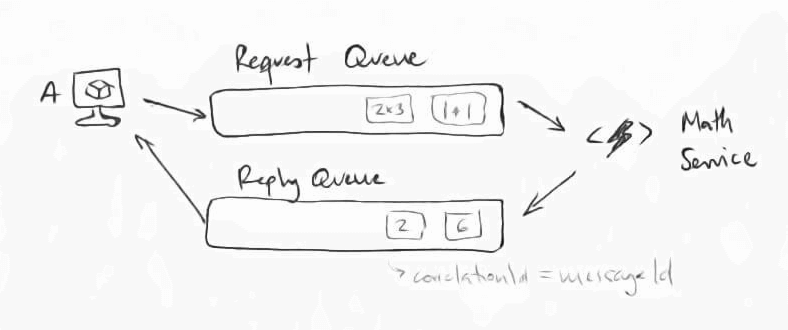
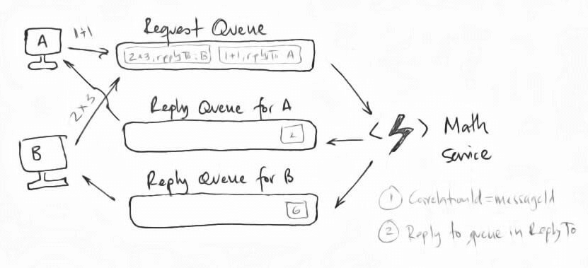
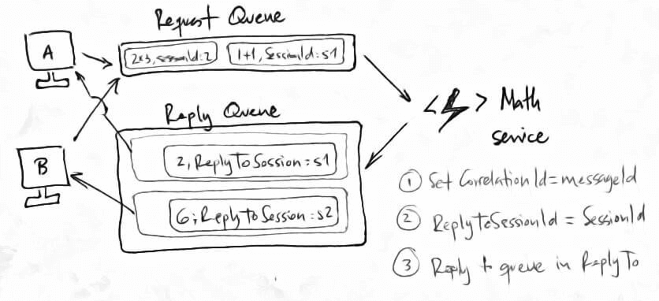

## *Connect and Consume 3rd Party Services*
---

 This is Part 3 of the [AZ-203 study guide]((../passing-az-203-exam/)). In this post we'll cover:

- [Develop an App Service Logic App](#develop-an-app-service-logic-app)
- [Retry Policies](#retry-policies)
- [Azure Search](#azure-search)
- [API Gateways](#api-gateways)
- [Event Grid](#event-grid)
- [Service Bus](#service-bus)
---

## Develop an App Service Logic App

A Logic App is a workflow you define to execute actions based on events, kind of an IFTTT version for your Azure subscription.

👉 For example, you could define a Logic App to check the blobs you have in a container and if they are older than a month, send a message to a queue so that an app could process them and move them to a less expensive archive storage.

💡 In the exam, I was asked to drag-drop activities into a workflow.

## Retry Policies 

Review the 4 different retry policies and their [JSON representations](https://docs.microsoft.com/en-us/azure/logic-apps/logic-apps-exception-handling#retry-policies).

| Retry Policy         | Details           
| --------------- |:-------------
| *Default*      | 4 exponential retries: intervals of 7.5 seconds, 12.5, 19.5....
| *Fixed interval*      | interval: PT20S (every 20 seconds express in ISO format)      
| *Exponential interval* | Minimun interval: PT10S, Maximum interval: PT1H
| *None* | Don't resend the request

Further reading: [ Retry Policies documentation 📖](https://docs.microsoft.com/en-us/azure/logic-apps/logic-apps-exception-handling)

## Azure Search
Creating and populating a search index with data.

### SearchServiceClient


```c#
// The operations related to managing indexes are performed using a `SearchServiceClient` object.

var serviceClient = new SearchServiceClient(
    "my-search-service-name",
    new SearchCredentials(adminApiKey)
);
```

### Create an index

``` c#
// Create an index with a list of fields with the [IsSearchable] attribute in the Order class.

var definition = new Index()
{
    Name = "orders",
    Fields = FieldBuilder.BuildForType<Order>()
};
serviceClient.Indexes.Create(definition)
```

### Prepare a batch of documents for upload

```c#
var indexClientForUpload = serviceClient.Indexes.GetClient("orders");

var batch = IndexBatch.Upload(orders); // orders being an array of Order objects.


```

### Actually upload the orders

```c#
indexClientForUpload.Documents.Index(batch);

```

### Search

```c#
var indexClientForQuery = new SearchIndexClient(
    "my-search-service-name",
    "orders",
    new SearchCredentials(queryApiKey)
);

var parameters = new SearchParameters() 
{
    Select = new[] { "orderNumber" }
};

var results = indexClientForQuery.Documents.Search<Order>("1234", parameters);
```

⚠️ NOTE: If results are missing in a search, make sure the properties in your class are "searchable".

## API Gateways

💡Know the 3 policy types: inbound, outbound and backend.

| Policy Type        | Details     | Common uses      
| --------------- |:------------- |:-------------
| *Inbound*      | Applied on the request when coming into the API | authentication, rate limiting, caching
| *Outbound*      | Applied on outbound information from the API | filter and transformation of data, caching
| *Backend* | Applied before calling a backend service and after a response from that service | transformation of data (xml-json), retry

💡If you are asked what type of policy to use to secure API access with OpenID, the answer is the `validate-jwt` policy.

## Event Grid

The Event Grid can be really helpful to build the backbone of serverless applications and event-driven applications. 

💡What's an event? A report in change of state of something. Events are then sent to topics. All subscribers of the topic will receive the event.

```json
{
    "destination": {
        "endpointBaseUrl": "https://my-id.ngrok.io/api/updates",
        "endpointType": "WebHook",      // ⚠️
        "endpointUrl": null
    },
    "filter": {
        "includedEventTypes": [
            "Microsoft.Storage.BlobCreated"         // ⚠️ 
        ],
        "subjectBeginsWith": "/blobServices/default/containers/testcontainer"
    }
}
```
⚠️ Make sure to understand the JSON for configuring a blob-created event subscription.

```bash
# ⚠️ What are webhooks?
A common means of consuming events.
```

Further reading: 
- [What is Azure Event Grid?](https://docs.microsoft.com/en-us/azure/event-grid/overview)
- [Choose between Azure messaging services - Event Grid, Event Hubs, and Service Bus](https://docs.microsoft.com/en-us/azure/event-grid/compare-messaging-services)


## Service Bus

A service bus is a fully managed message broker that gives you these benefits:

- Decoupled applications and services
- Session management
- Routing
- Dead-lettering
- Scheduling

### Create a queue
``` bash
# ⚠️ Creating a service bus queue in Azure CLI
az servicebus queue create
    --namespace-name az203sb
    -g servicebus
    -n testqueue
```

Or the equivalent powershell command:

``` ps
# ⚠️ Creating a service bus queue in Powershell
New-AzureRmServiceBusQueue
    -ResourceGroupName servicebus
    -NamespaceName az203sb
    -name testqueue
    -EnablePartitioning false
```
⚠️ Note that there are some questions in the exam where the answers are in Powershell.

### Service Bus Routing

A service bus queue is inherently for handling asynchronous calls. Fire and forget. So, if you need a response, before you can continue execution, how do you handle that? Let's look at a few examples.

#### Single reply queue (correlationId)


```bash
CorrelationId = MessageId
```




This works fine for a single client. But, as soon as you introduce a second client, since there is a shared queue, you can't tell which reply belongs to which client.

One way this can be solved is by using a queue for each client, which we'll see next.

#### Reply queue for each client

```bash
ReplyTo = client
```

In this scenario, each client has the responsibility to create its own temporary queue. Then, each client sends along with its requests sends the **ReplyTo** property.



This actually works well with some messaging systems, for example, RabbitMQ, but in the end it doesn't scale that well.

#### Sessions (replyToSessionId)

```bash
# ⚠️ 
ReplyToSessionId = session number
```

